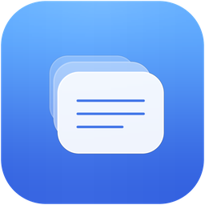

# Profile Isolator

[**中文**](README.md) | **English**

<p align="center">
  
</p>

<p align="center">
  <b>Run multiple Codex CLI / Claude Code instances with different providers at the same time</b><br/>
  One terminal → one API, model, and key — no cross-talk
</p>

<p align="center">
  
</p>

> Demo screenshot only — profile names and endpoints are placeholders, no real keys.

<p align="center">
  <a href="https://github.com/lottshin/profile-isolator/releases"></a>
  <a href="LICENSE"></a>
  
</p>

## The problem this solves

| You want | Without this tool | With Profile Isolator |
|----------|-------------------|------------------------|
| Terminal A → Codex on provider X | Edit global `~/.codex` | Launch profile “provider X” |
| Terminal B → Codex on provider Y **at the same time** | Change global config again; A breaks | Launch profile “provider Y” |
| Claude Code also needs another vendor | Edit `~/.claude` | Same workflow on the Claude tab |
| Resume the same project under another vendor | Sessions don’t line up | Optional shared sessions + same working directory |

**In short: multiple Codex / Claude Code processes in parallel, each on a different provider.**

How:

- **Codex**: isolated folder per profile, launch with `CODEX_HOME`
- **Claude Code**: isolated folder per profile, launch with `CLAUDE_CONFIG_DIR`

| CLI | Env | Config | Credentials | Sessions |
|-----|-----|--------|-------------|----------|
| **Codex** | `CODEX_HOME` | `config.toml` | `auth.json` | `sessions/` |
| **Claude Code** | `CLAUDE_CONFIG_DIR` | `settings.json` | `.credentials.json` (MCP OAuth) | `projects/` |

> Claude API key / base URL / model live in **`settings.json` → `env`** (`ANTHROPIC_*`).

## Features

- Multi-provider profiles for **Codex and Claude Code**  
- **Launch** isolated CLI processes (run many at once)  
- Shared sessions (junctions) for cross-provider `resume`  
- Create / import / **rename** / **duplicate** / delete / **reorder**  
- **Working directory remembered per profile**  
- Move both profile trees under one parent folder  
- Cache inspect / clean (sessions not auto-deleted)  
- Light / Dark / System theme  

## Download

Prebuilt Windows exe: [Releases](https://github.com/lottshin/profile-isolator/releases).

## Quick start (parallel providers)

1. Open app → **Codex** (or **Claude Code**)  
2. Create/import profile for provider A → set base URL, model, key → save  
3. Duplicate or create profile for provider B → change vendor settings  
4. **Launch** each → two terminals, two `CODEX_HOME` / `CLAUDE_CONFIG_DIR` values  
5. Same working directory + shared sessions → `resume` across providers  

Default paths:

```text
%USERPROFILE%\CodexProfiles\<name>
%USERPROFILE%\ClaudeProfiles\<name>
```

## Build from source

```powershell
cd desktop
npm install
npm run tauri build -- --no-bundle
```

## Security

Never commit live API keys or credential files. Redact before sharing screenshots.

## License

MIT — [LICENSE](LICENSE).
