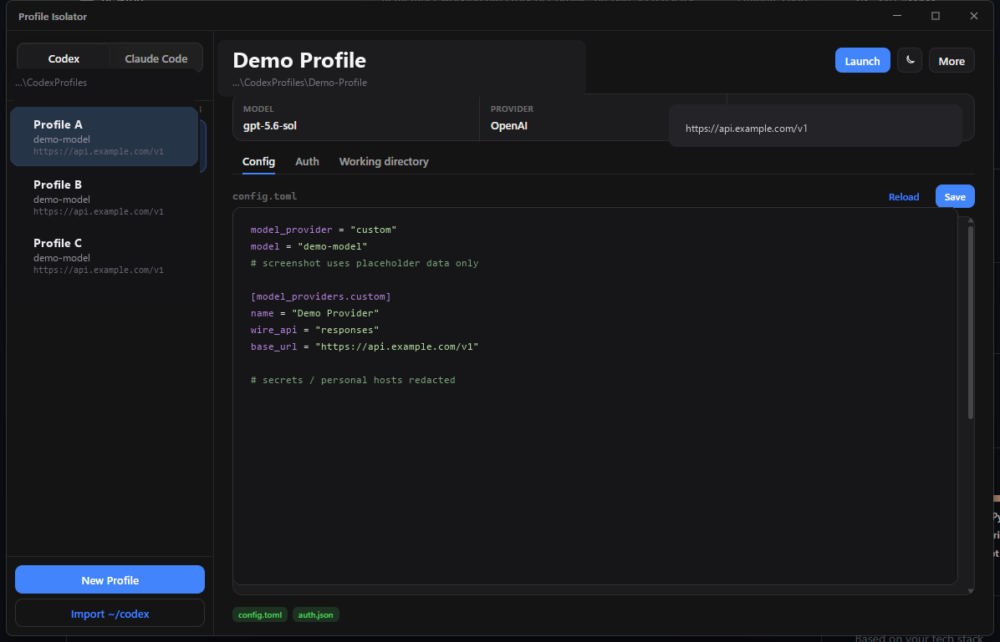

# Profile Isolator

**中文** | [English](#english)

Windows 桌面工具：为 **Codex** 与 **Claude Code** 管理多套隔离配置（不同供应商 / Key / 模型），会话可共享，方便跨配置 `resume`。

<p align="center">
  
</p>

> 截图仅为界面示意：**profile 名 / 路径 / 接口地址均为示例**，不含真实 Key。

<p align="center">
  <a href="https://github.com/lottshin/profile-isolator/releases"></a>
  <a href="LICENSE"></a>
  
</p>

## 解决什么问题

一个机器上经常要切换：

- 不同 API 供应商 / Base URL  
- 不同 Key、不同模型  
- Codex 与 Claude Code 两套生态  

官方默认都写在用户目录下一套配置里，混用容易串号。本工具为每个 profile 单独目录，启动时注入隔离环境变量，同时可选共享会话目录。

| CLI | 隔离环境变量 | 主配置 | 凭证 | 会话 |
|-----|-------------|--------|------|------|
| **Codex** | `CODEX_HOME` | `config.toml` | `auth.json` | `sessions/` |
| **Claude Code** | `CLAUDE_CONFIG_DIR` | `settings.json` | `.credentials.json`（主要 MCP OAuth） | `projects/` |

> Claude 的 API Key / Base URL / 模型在 **`settings.json` → `env`**（`ANTHROPIC_*`），不在 `.credentials.json`。

## 功能一览

- 图形界面管理 profile：新建 / 导入 / **重命名** / **复制** / 删除  
- **拖动手柄排序**（顺序保存在 `.profile-order.json`）  
- **一键 Launch**：单控制台启动 CLI，环境已隔离  
- **工作目录按 profile 记忆**（切换 profile 自动恢复）  
- 会话共享（junction 到默认 `~/.codex` / `~/.claude`，便于跨供应商 resume）  
- Codex + Claude 配置树可**一起搬到其他盘**（共用父目录）  
- 缓存查看 / 清理（`.sandbox-bin` 等，**不自动清会话**）  
- 浅色 / 深色 / 跟随系统  

## 下载

- **Windows 预编译**： [Releases](https://github.com/lottshin/profile-isolator/releases)  
  直接运行 `ProfileIsolator-v*.exe`（需 WebView2，Win11 一般已自带）

## 快速使用

1. 打开应用，选择 **Codex** 或 **Claude Code**  
2. **Import** 从当前 `~/.codex` / `~/.claude` 导入，或 **New Profile**  
3. 编辑 Config / Auth，保存  
4. 在 **Working directory** 选择项目目录（会按 profile 记住）  
5. 点 **Launch**  

默认路径：

```text
%USERPROFILE%\CodexProfiles\<name>
%USERPROFILE%\ClaudeProfiles\<name>
```

可在 **More → Cache & storage** 把两套树一起迁到例如 `F:\AI-Profiles\`。

本机设置：

```text
%USERPROFILE%\.profile-isolator\
```

## 从源码构建

```powershell
# 依赖：Node 18+、Rust stable、VS Build Tools (C++)
cd desktop
npm install
npm run tauri dev          # 开发
npm run tauri build -- --no-bundle   # 产出 exe
# desktop/src-tauri/target/release/ai_cli_profile_isolator.exe
```

可选：`python desktop/make_ios_icon.py` 重新生成图标。

## 安全提示

- **不要**把含真实 Key 的 `auth.json` / `settings.json` 提交到仓库或发到公开截图  
- 分享配置前请脱敏  
- 开源仓库不含 `dist/*.exe` 源码构建产物中的密钥  

## 项目结构

```text
├── desktop/          # 主程序：Tauri + React
├── app/              # 旧版 Python GUI（可选）
├── docs/screenshots/ # README 截图
├── share-sessions.cmd
└── README.md
```

## 许可证

MIT — 见 [LICENSE](LICENSE)。

---

<a id="english"></a>

# Profile Isolator (English)

Desktop app for **Codex** and **Claude Code** multi-profile isolation on Windows: separate providers, keys, and models, with optional shared sessions so `resume` works across profiles.


> Demo screenshot only — profile names and endpoints are placeholders.

## Why

You often need multiple API providers, keys, and models without mixing them in a single `~/.codex` / `~/.claude`. This tool keeps each profile in its own folder and launches the CLI with the right env var.

| CLI | Env | Config | Credentials | Sessions |
|-----|-----|--------|-------------|----------|
| **Codex** | `CODEX_HOME` | `config.toml` | `auth.json` | `sessions/` |
| **Claude Code** | `CLAUDE_CONFIG_DIR` | `settings.json` | `.credentials.json` (MCP OAuth) | `projects/` |

Claude API key / base URL / model live in **`settings.json` → `env`**.

## Features

- GUI: create, import, **rename**, **duplicate**, delete  
- **Drag-handle reorder** (`.profile-order.json`)  
- **Launch** into one console with isolated env  
- **Working directory remembered per profile**  
- Shared sessions via junctions for cross-provider resume  
- Move Codex + Claude trees under one parent folder  
- Cache inspect / clean (no auto-delete of sessions)  
- Light / Dark / System theme  

## Download

Prebuilt Windows exe: [Releases](https://github.com/lottshin/profile-isolator/releases).

## Quick start

1. Pick **Codex** or **Claude Code**  
2. Import or create a profile  
3. Edit config → set working directory → **Launch**  

## Build from source

```powershell
cd desktop
npm install
npm run tauri build -- --no-bundle
```

## Security

Never commit live API keys or credential files.

## License

MIT — [LICENSE](LICENSE).
